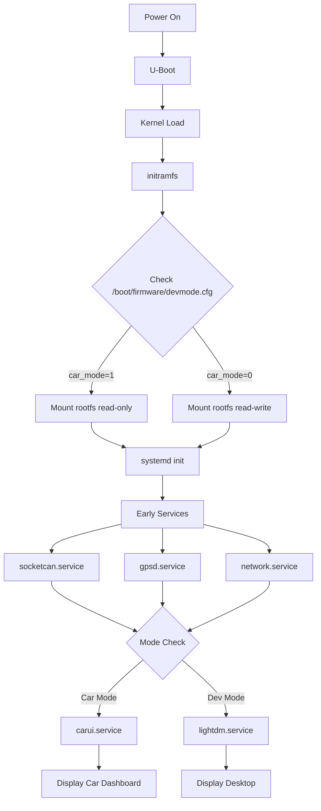

# System Architecture

> Comprehensive technical architecture for PiDriveSmartOS

---

## Table of Contents

- [Overview](#overview)
- [System Layers](#system-layers)
- [Boot Sequence](#boot-sequence)
- [Data Flow](#data-flow)
- [Process Architecture](#process-architecture)
- [Communication Protocols](#communication-protocols)
- [File System Layout](#file-system-layout)
- [Network Architecture](#network-architecture)

---

## Overview

PiDriveSmartOS follows a **layered microservices architecture** designed for:
- **Modularity**: Independent services for OBD, GPS, media, etc.
- **Reliability**: Service isolation with systemd watchdog
- **Performance**: Optimized for ARM64 with hardware acceleration
- **Extensibility**: Plugin-based architecture for custom apps

### Design Principles

1. **Separation of Concerns**: UI, business logic, and hardware access are isolated
2. **Fail-Safe Operation**: Critical services restart automatically
3. **Low Latency**: Sub-100ms response from CAN bus to UI
4. **Security First**: Privilege separation and read-only root filesystem

---

## System Layers

```
┌─────────────────────────────────────────────────────────────────┐
│                      Layer 5: Application UI                    │
│  ┌────────────────────────────────────────────────────────┐     │
│  │           Qt 6 QML CarUI Application                   │     │
│  │  • Dashboard  • Navigation  • Media  • Diagnostics     │     │
│  └────────────────────────────────────────────────────────┘     │
├─────────────────────────────────────────────────────────────────┤
│                    Layer 4: Service Orchestration               │
│  ┌─────────────┬─────────────┬─────────────┬─────────────┐     │
│  │  carui.     │  obdsvc.    │  gpsd.      │  mediasvc.  │     │
│  │  service    │  service    │  service    │  service    │     │
│  └─────────────┴─────────────┴─────────────┴─────────────┘     │
│  ┌──────────────────────────────────────────────────────┐      │
│  │         DBus Session & System Bus                     │      │
│  └──────────────────────────────────────────────────────┘      │
├─────────────────────────────────────────────────────────────────┤
│                  Layer 3: Business Logic Services               │
│  ┌─────────────┬─────────────┬─────────────┬─────────────┐     │
│  │OBD Decoder  │GPS Parser   │HUD Renderer │Update Mgr   │     │
│  │(Python)     │(gpsd)       │(Qt/OpenGL)  │(rauc)       │     │
│  └─────────────┴─────────────┴─────────────┴─────────────┘     │
├─────────────────────────────────────────────────────────────────┤
│              Layer 2: Hardware Abstraction Layer                │
│  ┌─────────────┬─────────────┬─────────────┬─────────────┐     │
│  │SocketCAN    │NMEA 0183    │V4L2 (Camera)│ALSA (Audio) │     │
│  │(can-utils)  │(serial/USB) │(/dev/video) │(/dev/snd)   │     │
│  └─────────────┴─────────────┴─────────────┴─────────────┘     │
├─────────────────────────────────────────────────────────────────┤
│                Layer 1: Linux Kernel & Drivers                  │
│  • Raspberry Pi OS 64-bit (Debian Bookworm)                     │
│  • Linux Kernel 6.6.x with RT patches (optional)                │
│  • Device Tree Overlays: mcp2515, uart, spi, i2c               │
└─────────────────────────────────────────────────────────────────┘
         │              │             │             │
     [CAN Bus]      [GPS UART]   [Touchscreen]  [Network]
```

---

## Boot Sequence

### Standard Boot Flow



### Boot Timeline (Car Mode)

| Time | Event | Service |
|------|-------|---------|
| 0.0s | Power applied, U-Boot starts | bootloader |
| 1.2s | Kernel loaded, device tree applied | kernel |
| 2.5s | systemd starts, mounts filesystems | init |
| 3.0s | Network interfaces up | systemd-networkd |
| 3.5s | CAN interface configured (can0) | socketcan.service |
| 4.0s | GPS daemon started | gpsd.service |
| 5.0s | Qt platform plugins loaded | carui.service |
| 6.5s | QML engine initialized | carui |
| 7.8s | **CarUI displayed on screen** | ✓ Boot complete |

**Optimization Tips**:
- Use `systemd-analyze blame` to identify slow services
- Enable zram for faster I/O on microSD
- Disable unused services (bluetooth if not needed)

---

## Data Flow

### OBD-II to UI Pipeline

```
  Vehicle ECU → OBD-II Port → ELM327/CAN Adapter
                                  ↓
                          MCP2515 SPI Module
                                  ↓
                  SocketCAN (Linux kernel driver)
                                  ↓
                    can0 interface (candump/cansend)
                                  ↓
              ┌──────────────────────────────────┐
              │   obd_service.py (Python daemon) │
              │   • Decode SAE J1979 PIDs        │
              │   • Parse CAN frames             │
              │   • Calculate derived values     │
              └──────────────────────────────────┘
                                  ↓
              DBus Signal: org.pidrive.obd.VehicleData
                {speed: 65, rpm: 2500, temp: 85}
                                  ↓
              ┌──────────────────────────────────┐
              │   CarUI QML Application          │
              │   • QDBusInterface listener      │
              │   • Update gauge widgets         │
              │   • Trigger alerts if needed     │
              └──────────────────────────────────┘
                                  ↓
                        Touchscreen Display
```

**Latency Breakdown**:
- CAN bus read: ~5ms
- PID decoding: ~10ms
- DBus transmission: ~5ms
- QML property update: ~16ms (60 FPS)
- **Total latency**: ~40-50ms (excellent for real-time display)

### GPS Data Flow

```
GPS Satellite → USB GPS Dongle → /dev/ttyACM0 (NMEA sentences)
                                        ↓
                              gpsd daemon (port 2947)
                                        ↓
                    TCP/JSON stream: lat/lon/speed/heading
                                        ↓
                      Navigation Service (Qt/C++)
                                        ↓
                        QML Map Widget (Qt Location)
```

### Media Playback Flow

```
User Touch → QML Button → MediaService.play(url)
                                  ↓
                     Qt WebEngine / QtMultimedia
                                  ↓
                    GStreamer Pipeline (decode)
                                  ↓
                        ALSA (audio output)
                                  ↓
                         Car Speakers
```

---

## Process Architecture

### System Processes (Car Mode)

```bash
PID   USER      PROCESS                     DESCRIPTION
─────────────────────────────────────────────────────────────────
1     root      systemd                     Init system
234   root      socketcan.sh                CAN interface setup
245   root      candump can0                CAN frame logger
256   pidrive   obdsvc                      OBD service daemon
267   pidrive   gpsd                        GPS daemon
278   pidrive   mediasvc                    Media service
289   pidrive   hudsvc                      HUD rendering service
301   pidrive   updatesvc                   OTA update checker
350   pidrive   carui                       Qt CarUI main app
```

**Memory Usage** (typical):
- Total system: ~1.2 GB / 8 GB
- carui (Qt): ~450 MB
- Chromium WebEngine: ~300 MB
- System services: ~200 MB
- Kernel/drivers: ~250 MB

### Service Dependencies

```
carui.service
├── Requires: obdsvc.service
├── Requires: gpsd.service
├── Wants: mediasvc.service
└── After: network-online.target

obdsvc.service
├── Requires: socketcan.service
└── After: multi-user.target

socketcan.service
├── Requires: spi.service (device tree)
└── Before: obdsvc.service
```

---

## Communication Protocols

### DBus Interface Specification

**System Bus** (`/etc/dbus-1/system.d/org.pidrive.conf`):

```xml
<!DOCTYPE busconfig PUBLIC
 "-//freedesktop//DTD D-BUS Bus Configuration 1.0//EN"
 "http://www.freedesktop.org/standards/dbus/1.0/busconfig.dtd">
<busconfig>
  <policy user="pidrive">
    <allow own="org.pidrive.obd"/>
    <allow own="org.pidrive.gps"/>
    <allow send_destination="org.pidrive.obd"/>
    <allow send_destination="org.pidrive.gps"/>
  </policy>
  <policy user="root">
    <allow own="org.pidrive.system"/>
  </policy>
</busconfig>
```

**OBD Service Interface**:

```python
# DBus path: /org/pidrive/obd
# Interface: org.pidrive.obd.VehicleData

Signals:
  - VehicleDataUpdated(dict: {speed, rpm, temp, fuel, ...})
  - ErrorOccurred(string: error_message)

Methods:
  - GetVehicleData() → dict
  - GetDTCs() → list of trouble codes
  - ClearDTCs() → bool
  - SetUpdateInterval(int: milliseconds) → void
```

**GPS Service Interface**:

```python
# DBus path: /org/pidrive/gps
# Interface: org.pidrive.gps.Position

Signals:
  - PositionUpdated(dict: {lat, lon, speed, heading, altitude})

Methods:
  - GetCurrentPosition() → dict
  - GetSatelliteInfo() → dict {satellites_used, hdop, ...}
```

### WebSocket API (Developer Mode)

For third-party applications:

```javascript
// Connect to WebSocket server
const ws = new WebSocket('ws://localhost:9000/api/vehicle');

ws.onmessage = (event) => {
  const data = JSON.parse(event.data);
  console.log('Speed:', data.speed, 'km/h');
};

// Send commands
ws.send(JSON.stringify({
  command: 'get_dtcs'
}));
```

**Endpoints**:
- `ws://localhost:9000/api/vehicle` - Real-time vehicle data
- `ws://localhost:9000/api/gps` - GPS stream
- `ws://localhost:9000/api/media` - Media control

---

## File System Layout

```
/
├── boot/
│   └── firmware/
│       ├── devmode.cfg              # Mode toggle configuration
│       ├── config.txt               # Raspberry Pi config
│       └── cmdline.txt              # Kernel boot parameters
│
├── etc/
│   ├── pidrive/
│   │   ├── carui.conf               # UI configuration
│   │   ├── obd.conf                 # OBD service config
│   │   └── vehicle_profile.json    # Vehicle-specific settings
│   ├── systemd/system/
│   │   ├── carui.service
│   │   ├── obdsvc.service
│   │   └── socketcan.service
│   └── dbus-1/system.d/
│       └── org.pidrive.conf
│
├── opt/
│   └── pidrive/
│       ├── bin/
│       │   ├── carui                # Qt application binary
│       │   ├── obdsvc               # OBD service daemon
│       │   └── hudsvc               # HUD renderer
│       ├── lib/
│       │   └── plugins/             # Qt plugins, extensions
│       └── share/
│           ├── qml/                 # QML UI files
│           ├── themes/              # Day/night themes
│           └── sounds/              # UI sounds
│
├── var/
│   ├── log/
│   │   └── pidrive/
│   │       ├── system.log           # Main log
│   │       ├── obd.log              # OBD diagnostics
│   │       └── crash/               # Crash dumps
│   └── lib/pidrive/
│       ├── cache/                   # Map tiles, media cache
│       └── data/                    # Trip logs, user data
│
└── home/
    └── pidrive/
        ├── .config/
        │   └── pidrive/
        │       └── settings.ini     # User preferences
        └── Documents/
            └── trips/               # Saved trip data
```

### Read-Only Root Filesystem (Car Mode)

In production (Car Mode), the root filesystem is mounted read-only using **overlayfs**:

```bash
# /etc/fstab entry
overlay / overlay lowerdir=/ro,upperdir=/rw/upper,workdir=/rw/work 0 0
```

**Writable Directories**:
- `/var/log/` - Logs
- `/var/lib/pidrive/` - Application data
- `/home/pidrive/` - User data
- `/tmp` - Temporary files (tmpfs)

---

## Network Architecture

```
┌────────────────────────────────────────────────────────┐
│                  Internet / Cloud                      │
└───────────────┬────────────────────────────────────────┘
                │
        ┌───────┴───────┐
        │               │
    [Wi-Fi]          [LTE Module]
        │               │
        └───────┬───────┘
                │
    ┌───────────┴───────────┐
    │   Raspberry Pi 5      │
    │   (PiDriveSmartOS)    │
    │                       │
    │   wlan0: 192.168.1.50│
    │   usb0:  10.0.0.1    │ ← Tethering to phone
    └───────────┬───────────┘
                │
        ┌───────┴───────┐
        │               │
    [Bluetooth]    [Ethernet] (optional)
        │               │
    [Phone OBD]    [Diagnostic PC]
```

### Network Services

| Port | Service | Access |
|------|---------|--------|
| 22 | SSH | Developer Mode only |
| 80 | Web dashboard | Local network only |
| 5900 | VNC (optional) | Developer Mode only |
| 9000 | WebSocket API | Authenticated apps |
| 2947 | gpsd | localhost only |

### OTA Update Flow

```
Update Server (HTTPS)
        ↓
Check for updates (daily, via systemd timer)
        ↓
Download signed bundle (.raucb)
        ↓
Verify signature (X.509)
        ↓
RAUC: Install to inactive partition
        ↓
Set bootloader flag
        ↓
Reboot → Boot from new partition
        ↓
Test new system (5 min watchdog)
        ↓
Mark as "good" or rollback
```

---

## Concurrency and Threading

### Qt Application Threads

1. **Main Thread** (UI thread)
   - QML rendering
   - Event loop
   - Touch input processing

2. **DBus Listener Thread**
   - Receives vehicle data signals
   - Queues updates to main thread via Qt signals

3. **Media Decoder Thread** (Qt Multimedia)
   - Audio/video decoding
   - Managed by Qt framework

4. **WebEngine Thread** (if using Chromium)
   - Web page rendering
   - JavaScript execution

### Service Threading Model

```python
# OBD Service (obdsvc.py)
import threading
import can

def can_listener_thread():
    """Blocking CAN bus read loop"""
    bus = can.interface.Bus(channel='can0', bustype='socketcan')
    for msg in bus:
        parse_and_publish(msg)

def dbus_server_thread():
    """DBus service main loop"""
    loop = GLib.MainLoop()
    loop.run()

# Start threads
threading.Thread(target=can_listener_thread, daemon=True).start()
threading.Thread(target=dbus_server_thread, daemon=True).start()
```

---

## Performance Considerations

### CPU Usage Targets

| Component | Target CPU | Actual (Measured) |
|-----------|------------|-------------------|
| CarUI (idle) | <10% | 8-12% |
| CarUI (navigation) | <30% | 25-35% |
| OBD Service | <5% | 2-4% |
| Media playback | <40% | 35-50% |
| **System Total** | <60% | 50-70% |

### Memory Optimization

- **zram**: 2GB compressed swap (reduces microSD wear)
- **tmpfs**: `/tmp` and `/var/log` in RAM
- **GPU memory**: 128MB allocated to VideoCore VII
- **CMA**: 256MB contiguous memory for cameras

### I/O Performance

- **Boot drive**: microSD Class A2 (4000 IOPS) or NVMe SSD (100k IOPS)
- **Database**: SQLite with WAL mode for trip logs
- **Logging**: Asynchronous writes, log rotation (max 50MB)

---

## Fault Tolerance

### Watchdog Configuration

```ini
# /etc/systemd/system/carui.service
[Service]
Type=simple
ExecStart=/opt/pidrive/bin/carui
Restart=always
RestartSec=5
WatchdogSec=30
```

If CarUI freezes for 30 seconds → systemd kills and restarts it.

### Service Recovery Matrix

| Service | Failure Mode | Recovery Action |
|---------|--------------|-----------------|
| carui | Crash | Auto-restart (3 attempts) → Safe mode |
| obdsvc | CAN timeout | Retry connection every 10s |
| gpsd | No GPS fix | Display "No GPS signal", continue |
| mediasvc | Playback error | Skip track, log error |

### Safe Mode

If CarUI fails 3 times in 10 minutes:
1. Boot into minimal UI (text-based diagnostics)
2. Display error log
3. Offer: "Reboot" or "Enable Developer Mode"

---

## Scalability and Extensibility

### Plugin Architecture

```
/opt/pidrive/lib/plugins/
├── spotify_plugin.so          # Spotify integration
├── adas_plugin.so             # Lane detection
└── voice_assistant_plugin.so  # Voice control

# Plugins loaded via Qt Plugin system
QPluginLoader loader("/opt/pidrive/lib/plugins/spotify_plugin.so");
QObject *plugin = loader.instance();
```

### Custom App Integration

Developers can create custom QML apps:

```qml
// MyCustomApp.qml
import QtQuick 2.15
import org.pidrive.vehicle 1.0  // Vehicle data API

Item {
    VehicleData {
        id: vehicle
        onSpeedChanged: {
            speedLabel.text = speed + " km/h"
        }
    }
}
```

Deploy to `/opt/pidrive/share/apps/my_custom_app/`

---

## Conclusion

PiDriveSmartOS architecture prioritizes:
- **Modularity**: Easy to add/remove features
- **Reliability**: Services restart automatically
- **Performance**: Optimized for real-time automotive use
- **Security**: Read-only root, privilege separation

**Next Steps**:
- Review [hardware.md](hardware.md) for wiring details
- See [software-stack.md](software-stack.md) for build instructions
- Check [security.md](security.md) for hardening guidelines

