# CI/CD and OTA Update Pipeline

> Continuous Integration, Delivery, and Over-The-Air update strategy for PiDriveSmartOS

---

## Table of Contents

- [Overview](#overview)
- [CI/CD Architecture](#cicd-architecture)
- [GitHub Actions Workflows](#github-actions-workflows)
- [Docker Build Environment](#docker-build-environment)
- [Image Building](#image-building)
- [OTA Update System](#ota-update-system)
- [Deployment Strategy](#deployment-strategy)
- [Security and Signing](#security-and-signing)
- [Monitoring and Rollback](#monitoring-and-rollback)

---

## Overview

### Why CI/CD for PiDriveSmartOS?

**Challenges**:
- Complex multi-component system (Qt UI, Python services, Linux OS)
- ARM64 cross-compilation required
- Safety-critical automotive application
- Need for reproducible, tested builds
- Seamless updates for end-users

**Goals**:
1. **Automated Building**: Cross-compile for ARM64 on every commit
2. **Continuous Testing**: Unit tests, integration tests, hardware-in-loop tests
3. **Reproducible Images**: Bit-for-bit identical builds
4. **Secure OTA**: Signed, verified updates with rollback capability
5. **Fast Iteration**: From commit to testable image in < 30 minutes

### CI/CD Pipeline Overview

```mermaid
flowchart TB
    Developer["👨‍💻 Developer<br/>Push Code"] --> GitHub["📦 GitHub<br/>Repository"]
    
    GitHub --> Trigger["🔔 Webhook Trigger"]
    
    Trigger --> CI["⚙️ CI Pipeline<br/>(GitHub Actions)"]
    
    CI --> Build["🏗️ Build Stage"]
    Build --> BuildQt["Build Qt CarUI<br/>(ARM64)"]
    Build --> BuildPython["Package Python Services"]
    Build --> BuildImage["Create OS Image<br/>(pi-gen)"]
    
    Build --> Test["🧪 Test Stage"]
    Test --> UnitTest["Unit Tests"]
    Test --> IntTest["Integration Tests"]
    Test --> QATest["QA Validation"]
    
    Test --> Package["📦 Package Stage"]
    Package --> CreateBundle["Create Update Bundle<br/>(.raucb)"]
    Package --> Sign["Sign with X.509<br/>Certificate"]
    
    Package --> Publish["🚀 Publish Stage"]
    Publish --> GHRelease["GitHub Release"]
    Publish --> OTAServer["OTA Update Server"]
    
    OTAServer --> Vehicle["🚗 Vehicle<br/>PiDriveSmartOS"]
    Vehicle --> Download["Download Update"]
    Download --> Verify["Verify Signature"]
    Verify --> Install["Install to<br/>Inactive Partition"]
    Install --> Reboot["Reboot & Test"]
    Reboot --> Success{"Success?"}
    Success -->|Yes| MarkGood["Mark Partition<br/>as Good"]
    Success -->|No| Rollback["Rollback to<br/>Previous Version"]
```



---

## CI/CD Architecture

### Technology Stack

| Component | Technology | Purpose |
|-----------|------------|---------|
| **CI Platform** | GitHub Actions | Automated workflows |
| **Build Environment** | Docker (buildx) | Reproducible ARM64 builds |
| **Cross-Compiler** | gcc-aarch64-linux-gnu | ARM64 binaries |
| **Qt Framework** | Qt 6.5 (cross-compiled) | UI application |
| **Image Builder** | pi-gen or Yocto | Complete OS images |
| **OTA System** | RAUC | A/B partition updates |
| **Package Format** | .raucb (squashfs) | Update bundles |
| **Artifact Storage** | GitHub Releases + S3 | Version management |
| **Monitoring** | Prometheus + Grafana | Fleet monitoring |

### Build Matrix

| Build Target | Platform | Output |
|--------------|----------|--------|
| **Qt CarUI** | ARM64 | `carui` binary |
| **Python Services** | ARM64 | Python wheels |
| **System Image** | ARM64 | `pidriveos-vX.Y.Z.img.xz` |
| **Update Bundle** | ARM64 | `pidriveos-vX.Y.Z.raucb` |
| **Documentation** | x86_64 | GitHub Pages |

---

## GitHub Actions Workflows

### Main Workflow: Build and Test

**File**: `.github/workflows/build.yml`

```yaml
name: Build PiDriveSmartOS

on:
  push:
    branches: [ main, develop ]
  pull_request:
    branches: [ main ]
  release:
    types: [ published ]

env:
  QT_VERSION: 6.5.3
  DEBIAN_VERSION: bookworm
  
jobs:
  # Job 1: Build Qt CarUI (cross-compile)
  build-carui:
    runs-on: ubuntu-latest
    
    steps:
      - name: Checkout code
        uses: actions/checkout@v4
        with:
          submodules: recursive
      
      - name: Set up QEMU
        uses: docker/setup-qemu-action@v3
      
      - name: Set up Docker Buildx
        uses: docker/setup-buildx-action@v3
      
      - name: Cache Qt build
        uses: actions/cache@v3
        with:
          path: /opt/qt6
          key: qt6-${{ env.QT_VERSION }}-arm64
      
      - name: Install cross-compile toolchain
        run: |
          sudo apt-get update
          sudo apt-get install -y \
            gcc-aarch64-linux-gnu \
            g++-aarch64-linux-gnu \
            cmake \
            ninja-build
      
      - name: Cross-compile Qt CarUI
        run: |
          cd src/carui
          mkdir build && cd build
          
          cmake .. \
            -DCMAKE_TOOLCHAIN_FILE=../toolchain-aarch64.cmake \
            -DCMAKE_BUILD_TYPE=Release \
            -GNinja
          
          ninja
      
      - name: Upload CarUI artifact
        uses: actions/upload-artifact@v3
        with:
          name: carui-arm64
          path: src/carui/build/carui
  
  # Job 2: Build Python Services
  build-python:
    runs-on: ubuntu-latest
    
    steps:
      - name: Checkout code
        uses: actions/checkout@v4
      
      - name: Set up Python
        uses: actions/setup-python@v4
        with:
          python-version: '3.11'
      
      - name: Install dependencies
        run: |
          python -m pip install --upgrade pip
          pip install build wheel
      
      - name: Build Python packages
        run: |
          cd src/obd_service
          python -m build
      
      - name: Upload Python artifacts
        uses: actions/upload-artifact@v3
        with:
          name: python-services
          path: src/obd_service/dist/*.whl
  
  # Job 3: Run tests
  test:
    needs: [build-carui, build-python]
    runs-on: ubuntu-latest
    
    steps:
      - name: Checkout code
        uses: actions/checkout@v4
      
      - name: Download artifacts
        uses: actions/download-artifact@v3
      
      - name: Run unit tests (Python)
        run: |
          pip install pytest pytest-cov
          pytest src/obd_service/tests/ --cov
      
      - name: Run Qt tests
        run: |
          # Use QEMU for ARM64 tests
          docker run --rm --platform linux/arm64 \
            -v $(pwd):/workspace \
            debian:bookworm \
            /workspace/carui-arm64/carui --test
      
      - name: Upload coverage
        uses: codecov/codecov-action@v3
  
  # Job 4: Build OS image (only on release)
  build-image:
    if: github.event_name == 'release'
    needs: [test]
    runs-on: ubuntu-latest
    
    steps:
      - name: Checkout pi-gen
        uses: actions/checkout@v4
        with:
          repository: RPi-Distro/pi-gen
          path: pi-gen
      
      - name: Checkout PiDriveSmartOS
        uses: actions/checkout@v4
        with:
          path: pidriveos
      
      - name: Download all artifacts
        uses: actions/download-artifact@v3
        with:
          path: artifacts/
      
      - name: Prepare custom stage
        run: |
          mkdir -p pi-gen/stage-pidrive/00-install-pidrive
          cp -r pidriveos/scripts/* pi-gen/stage-pidrive/00-install-pidrive/
          cp -r artifacts/* pi-gen/stage-pidrive/00-install-pidrive/
      
      - name: Build image
        run: |
          cd pi-gen
          
          # Skip default stages (use lite)
          touch ./stage3/SKIP ./stage4/SKIP ./stage5/SKIP
          
          # Set custom config
          cat > config <<EOF
          IMG_NAME="PiDriveSmartOS"
          RELEASE="bookworm"
          DEPLOY_COMPRESSION="xz"
          TARGET_HOSTNAME="pidrive"
          ENABLE_SSH=0
          EOF
          
          # Build
          sudo ./build.sh
      
      - name: Upload OS image
        uses: actions/upload-artifact@v3
        with:
          name: pidriveos-image
          path: pi-gen/deploy/*.img.xz
      
      - name: Create GitHub Release
        uses: softprops/action-gh-release@v1
        with:
          files: pi-gen/deploy/*.img.xz
          body: |
            ## PiDriveSmartOS ${{ github.ref_name }}
            
            ### Changes
            ${{ github.event.release.body }}
            
            ### Installation
            ```bash
            xzcat pidriveos-${{ github.ref_name }}.img.xz | sudo dd of=/dev/sdX bs=4M status=progress
            ```
  
  # Job 5: Build OTA update bundle
  build-ota-bundle:
    if: github.event_name == 'release'
    needs: [build-image]
    runs-on: ubuntu-latest
    
    steps:
      - name: Checkout code
        uses: actions/checkout@v4
      
      - name: Download image
        uses: actions/download-artifact@v3
        with:
          name: pidriveos-image
      
      - name: Install RAUC
        run: |
          sudo apt-get update
          sudo apt-get install -y rauc
      
      - name: Extract rootfs from image
        run: |
          xz -d *.img.xz
          # Mount and extract rootfs (simplified)
          ./scripts/extract_rootfs.sh *.img
      
      - name: Create RAUC bundle
        run: |
          # Sign bundle with private key
          rauc bundle \
            --cert=${{ secrets.RAUC_CERT }} \
            --key=${{ secrets.RAUC_KEY }} \
            rootfs/ \
            pidriveos-${{ github.ref_name }}.raucb
      
      - name: Upload OTA bundle
        uses: actions/upload-artifact@v3
        with:
          name: ota-bundle
          path: "*.raucb"
      
      - name: Deploy to OTA server
        run: |
          # Upload to S3 or custom OTA server
          aws s3 cp pidriveos-${{ github.ref_name }}.raucb \
            s3://pidriveos-updates/releases/ \
            --acl public-read
        env:
          AWS_ACCESS_KEY_ID: ${{ secrets.AWS_ACCESS_KEY_ID }}
          AWS_SECRET_ACCESS_KEY: ${{ secrets.AWS_SECRET_ACCESS_KEY }}
```

### Linting and Code Quality

**File**: `.github/workflows/lint.yml`

```yaml
name: Code Quality

on: [push, pull_request]

jobs:
  lint-cpp:
    runs-on: ubuntu-latest
    steps:
      - uses: actions/checkout@v4
      
      - name: Install clang-format
        run: sudo apt-get install -y clang-format
      
      - name: Check C++ formatting
        run: |
          find src/carui -name "*.cpp" -o -name "*.h" | \
            xargs clang-format --dry-run --Werror
  
  lint-python:
    runs-on: ubuntu-latest
    steps:
      - uses: actions/checkout@v4
      
      - uses: actions/setup-python@v4
        with:
          python-version: '3.11'
      
      - name: Install linters
        run: pip install black flake8 mypy
      
      - name: Run Black
        run: black --check src/obd_service/
      
      - name: Run Flake8
        run: flake8 src/obd_service/ --max-line-length=100
      
      - name: Run mypy
        run: mypy src/obd_service/
```

---

## Docker Build Environment

### Cross-Compilation Dockerfile

**File**: `.github/docker/Dockerfile.cross`

```dockerfile
FROM debian:bookworm

# Install cross-compilation tools
RUN apt-get update && apt-get install -y \
    gcc-aarch64-linux-gnu \
    g++-aarch64-linux-gnu \
    cmake \
    ninja-build \
    git \
    wget \
    qt6-base-dev:arm64 \
    qt6-declarative-dev:arm64 \
    libqt6dbus6:arm64

# Set up environment
ENV CMAKE_TOOLCHAIN_FILE=/toolchain-aarch64.cmake
ENV PKG_CONFIG_PATH=/usr/lib/aarch64-linux-gnu/pkgconfig

# Copy toolchain file
COPY toolchain-aarch64.cmake /toolchain-aarch64.cmake

WORKDIR /workspace

CMD ["/bin/bash"]
```

### CMake Toolchain File

**File**: `src/carui/toolchain-aarch64.cmake`

```cmake
# Cross-compilation toolchain for ARM64
set(CMAKE_SYSTEM_NAME Linux)
set(CMAKE_SYSTEM_PROCESSOR aarch64)

# Specify the cross compiler
set(CMAKE_C_COMPILER aarch64-linux-gnu-gcc)
set(CMAKE_CXX_COMPILER aarch64-linux-gnu-g++)

# Where to look for libraries
set(CMAKE_FIND_ROOT_PATH /usr/aarch64-linux-gnu)

# Search for programs in the build host directories
set(CMAKE_FIND_ROOT_PATH_MODE_PROGRAM NEVER)

# Search for libraries and headers in the target directories
set(CMAKE_FIND_ROOT_PATH_MODE_LIBRARY ONLY)
set(CMAKE_FIND_ROOT_PATH_MODE_INCLUDE ONLY)
set(CMAKE_FIND_ROOT_PATH_MODE_PACKAGE ONLY)

# Qt-specific paths
set(QT_HOST_PATH /usr)
set(QT_QMAKE_EXECUTABLE /usr/bin/qmake6)
```

---

## Image Building

### Method 1: pi-gen (Recommended)

**Pi-gen** is the official Raspberry Pi image builder.

#### Custom Stage Structure

```
pi-gen/
└── stage-pidrive/
    ├── 00-install-pidrive/
    │   ├── 00-run.sh
    │   ├── files/
    │   │   ├── opt/pidrive/
    │   │   │   └── bin/carui
    │   │   ├── etc/pidrive/
    │   │   └── usr/lib/systemd/system/
    │   └── 00-packages
    └── 01-configure-system/
        └── 00-run.sh
```

**File**: `stage-pidrive/00-install-pidrive/00-run.sh`

```bash
#!/bin/bash -e

# Install PiDriveSmartOS components
on_chroot << EOF
  # Install Qt6
  apt-get install -y qt6-base-dev qt6-declarative-dev can-utils gpsd python3-pip
  
  # Install Python dependencies
  pip3 install python-can python-obd dbus-python
  
  # Copy application files
  mkdir -p /opt/pidrive/bin
  cp /tmp/carui /opt/pidrive/bin/
  chmod +x /opt/pidrive/bin/carui
  
  # Copy Python services
  cp -r /tmp/obd_service /opt/pidrive/
  
  # Install systemd services
  cp /tmp/systemd/*.service /etc/systemd/system/
  systemctl enable carui.service obdsvc.service
  
  # Create users
  useradd -r -m -s /bin/bash pidrive
  useradd -r -s /usr/sbin/nologin obduser
  
  # Set permissions
  chown -R pidrive:pidrive /opt/pidrive
EOF
```

### Method 2: Yocto/OpenEmbedded (Advanced)

For production systems requiring tight control:

```bash
# Clone Yocto Poky
git clone -b kirkstone git://git.yoctoproject.org/poky.git

# Clone Raspberry Pi layer
cd poky
git clone -b kirkstone git://git.yoctoproject.org/meta-raspberrypi

# Initialize build environment
source oe-init-build-env pidriveos-build

# Add layers
bitbake-layers add-layer ../meta-raspberrypi
bitbake-layers add-layer ../meta-pidrive  # Custom layer

# Configure machine
echo 'MACHINE = "raspberrypi5"' >> conf/local.conf

# Build image
bitbake pidriveos-image
```

---

## OTA Update System

### RAUC (Recommended)

**RAUC** provides atomic, safe, A/B partition updates.

#### System Configuration

**File**: `/etc/rauc/system.conf`

```ini
[system]
compatible=pidriveos-rpi5
bootloader=uboot
mountprefix=/mnt/rauc
statusfile=/data/rauc.status

[keyring]
path=/etc/rauc/ca.cert.pem
use-bundle-signing-time=true

[slot.rootfs.0]
device=/dev/mmcblk0p2
type=ext4
bootname=A
readonly=false

[slot.rootfs.1]
device=/dev/mmcblk0p3
type=ext4
bootname=B
readonly=false
```

#### Update Bundle Manifest

**File**: `manifest.raucm`

```ini
[update]
compatible=pidriveos-rpi5
version=1.0.0
description=PiDriveSmartOS v1.0.0 Update

[bundle]
format=verity

[image.rootfs]
filename=rootfs.img
size=2147483648
sha256=a1b2c3d4e5f6...
hooks=post-install

[handler]
filename=post-install.sh
```

#### OTA Update Client Service

**File**: `/opt/pidrive/bin/ota_update_client.py`

```python
#!/usr/bin/env python3
"""
OTA Update Client for PiDriveSmartOS

Checks for updates, downloads, and installs via RAUC
"""

import requests
import subprocess
import json
import logging
from pathlib import Path

UPDATE_SERVER = "https://updates.pidriveos.org"
VERSION_FILE = "/opt/pidrive/version.txt"
CERT_FILE = "/etc/rauc/ca.cert.pem"

def get_current_version():
    """Read current system version"""
    try:
        return Path(VERSION_FILE).read_text().strip()
    except:
        return "0.0.0"

def check_for_update():
    """Check update server for new version"""
    current_version = get_current_version()
    
    response = requests.get(
        f"{UPDATE_SERVER}/api/check_update",
        params={"version": current_version, "device": "rpi5"},
        timeout=10
    )
    
    if response.status_code == 200:
        data = response.json()
        if data["update_available"]:
            return data["download_url"], data["version"]
    
    return None, None

def download_update(url, dest="/tmp/update.raucb"):
    """Download update bundle"""
    logging.info(f"Downloading update from {url}")
    
    response = requests.get(url, stream=True)
    with open(dest, 'wb') as f:
        for chunk in response.iter_content(chunk_size=8192):
            f.write(chunk)
    
    logging.info("Download complete")
    return dest

def install_update(bundle_path):
    """Install update using RAUC"""
    logging.info(f"Installing update: {bundle_path}")
    
    result = subprocess.run(
        ["rauc", "install", bundle_path],
        capture_output=True,
        text=True
    )
    
    if result.returncode == 0:
        logging.info("Update installed successfully")
        return True
    else:
        logging.error(f"Update failed: {result.stderr}")
        return False

def main():
    logging.basicConfig(level=logging.INFO)
    
    # Check for updates
    url, version = check_for_update()
    
    if url:
        logging.info(f"New version available: {version}")
        
        # Download
        bundle = download_update(url)
        
        # Install
        if install_update(bundle):
            logging.info("Update will be applied on next reboot")
            # Schedule reboot
            subprocess.run(["shutdown", "-r", "+5"])
        else:
            logging.error("Update installation failed")
    else:
        logging.info("System is up to date")

if __name__ == "__main__":
    main()
```

#### Systemd Timer for Automatic Updates

**File**: `/etc/systemd/system/ota-update.timer`

```ini
[Unit]
Description=Check for PiDriveSmartOS updates daily

[Timer]
OnCalendar=daily
Persistent=true

[Install]
WantedBy=timers.target
```

**File**: `/etc/systemd/system/ota-update.service`

```ini
[Unit]
Description=PiDriveSmartOS OTA Update Check
Wants=network-online.target
After=network-online.target

[Service]
Type=oneshot
ExecStart=/usr/bin/python3 /opt/pidrive/bin/ota_update_client.py
User=root
StandardOutput=journal
StandardError=journal

[Install]
WantedBy=multi-user.target
```

---

## Deployment Strategy

### Release Channels


### Version Scheme

**Semantic Versioning**: `MAJOR.MINOR.PATCH`

- **MAJOR**: Breaking changes (e.g., 1.0.0 → 2.0.0)
- **MINOR**: New features (e.g., 1.0.0 → 1.1.0)
- **PATCH**: Bug fixes (e.g., 1.0.0 → 1.0.1)

**Examples**:
- `v0.9.0` - Pre-release (beta)
- `v1.0.0` - First stable release
- `v1.1.0` - Added Android Auto support
- `v1.1.1` - Fixed CAN bus timeout

### Rollout Strategy

**Phased Rollout**:

1. **Internal (Day 0)**: 10 test vehicles
2. **Beta (Day 3)**: 100 beta testers
3. **Staged (Day 7)**: 10% of production fleet
4. **General (Day 14)**: 100% of production fleet

**Monitoring**: Track success rate, rollback rate, crash reports

---

## Security and Signing

### Certificate Generation

```bash
# Generate CA certificate (keep offline!)
openssl genrsa -aes256 -out ca-key.pem 4096
openssl req -new -x509 -days 3650 -key ca-key.pem -out ca-cert.pem

# Generate RAUC signing certificate
openssl genrsa -out rauc-key.pem 2048
openssl req -new -key rauc-key.pem -out rauc.csr
openssl x509 -req -in rauc.csr -CA ca-cert.pem -CAkey ca-key.pem \
  -CAcreateserial -out rauc-cert.pem -days 1825

# Install public cert on devices
sudo cp ca-cert.pem /etc/rauc/ca.cert.pem
```

### GitHub Secrets

Store in GitHub repository settings:

- `RAUC_CERT`: Public certificate (can be public)
- `RAUC_KEY`: Private signing key (SECRET!)
- `AWS_ACCESS_KEY_ID`: For S3 uploads
- `AWS_SECRET_ACCESS_KEY`: For S3 uploads

### Update Bundle Signing

```bash
# Create bundle with signature
rauc bundle \
  --cert=rauc-cert.pem \
  --key=rauc-key.pem \
  rootfs/ \
  pidriveos-v1.0.0.raucb

# Verify bundle
rauc info pidriveos-v1.0.0.raucb
```

---

## Monitoring and Rollback

### Health Checks

After update installation, system performs health checks:

```python
def health_check():
    """Verify system is functioning after update"""
    checks = [
        check_can_interface(),
        check_obd_service(),
        check_gps_fix(),
        check_display_output(),
        check_touch_input()
    ]
    
    return all(checks)

def mark_boot_successful():
    """Mark current partition as good"""
    if health_check():
        subprocess.run(["rauc", "status", "mark-good"])
        logging.info("Update successful, marked partition as good")
    else:
        logging.error("Health check failed, will rollback")
        subprocess.run(["reboot"])  # Will boot previous partition
```

### Automatic Rollback

**U-Boot Watchdog**:
- After update, boot watchdog is active
- If system doesn't mark partition as "good" within 5 minutes, automatic rollback
- Previous working partition is restored

**Manual Rollback**:

```bash
# Rollback to previous version
sudo rauc status mark-bad booted
sudo reboot
```

### Telemetry

```python
# Report update status to cloud
def report_update_status(status):
    """Send update status to monitoring server"""
    data = {
        "device_id": get_device_id(),
        "version": get_current_version(),
        "status": status,  # "success", "failed", "rollback"
        "timestamp": time.time()
    }
    
    requests.post(
        "https://telemetry.pidriveos.org/api/update_status",
        json=data
    )
```

---

## Local Development Testing

### Test OTA Updates Locally

```bash
# Build local update bundle
cd /path/to/pidriveos
./scripts/build_ota_bundle.sh

# Install on test device
scp pidriveos-v1.0.1.raucb pi@testcar.local:/tmp/
ssh pi@testcar.local "sudo rauc install /tmp/pidriveos-v1.0.1.raucb"

# Reboot and verify
ssh pi@testcar.local "sudo reboot"
```

### USB Recovery

For failed updates:

```bash
# Boot from USB recovery drive
# Mount root partition
sudo mount /dev/mmcblk0p2 /mnt

# Restore from backup
sudo rsync -av /backup/rootfs/ /mnt/

# Fix bootloader
sudo mount /dev/mmcblk0p1 /mnt/boot
echo "boot_partition=2" > /mnt/boot/uboot.env
```

---

## Best Practices

### DO ✅

- Always sign update bundles
- Test updates on hardware before release
- Implement automatic rollback
- Monitor fleet health after rollout
- Keep offline CA key secure
- Version all components consistently
- Document changes in release notes

### DON'T ❌

- Push untested updates to production
- Skip signature verification
- Ignore failed health checks
- Update without rollback capability
- Store private keys in repository
- Auto-update without user confirmation (Car Mode)
- Update while vehicle is in motion

---

## Troubleshooting

| Issue | Cause | Solution |
|-------|-------|----------|
| CI build fails | Missing dependencies | Check Dockerfile, update packages |
| Cross-compile errors | Wrong toolchain | Verify `toolchain-aarch64.cmake` |
| Image too large | Unnecessary packages | Optimize pi-gen stage, remove bloat |
| OTA download fails | Network timeout | Increase timeout, retry logic |
| Update won't install | Signature mismatch | Regenerate certificate, re-sign bundle |
| Rollback loop | Health check always fails | Fix health check logic, manual recovery |

---

## Future Enhancements

- **Delta Updates**: Only download changed files (smaller updates)
- **P2P Updates**: Fleet vehicles share updates (reduce bandwidth)
- **ML-Based Rollout**: Predict update success based on device characteristics
- **Edge Caching**: CDN for faster downloads
- **Multi-Region**: Serve updates from nearest server

---

## Resources

- **RAUC Documentation**: [rauc.io](https://rauc.io)
- **GitHub Actions**: [docs.github.com/actions](https://docs.github.com/actions)
- **pi-gen**: [github.com/RPi-Distro/pi-gen](https://github.com/RPi-Distro/pi-gen)
- **Yocto Project**: [yoctoproject.org](https://www.yoctoproject.org)
- **Docker Buildx**: [docs.docker.com/buildx](https://docs.docker.com/buildx/)

---

**Last Updated**: 2024-10-28  
**Pipeline Version**: 1.0  
**Tested with**: GitHub Actions, RAUC 1.10, pi-gen (2024)

