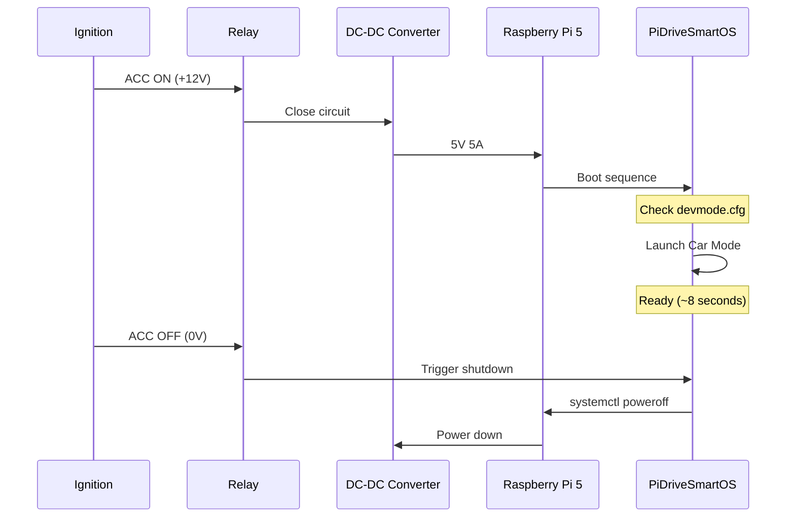

# Hardware Wiring Guide

> Complete wiring diagrams, Bill of Materials, and assembly instructions for PiDriveSmartOS

---

## Table of Contents

- [System Diagram](#system-diagram)
- [Bill of Materials](#bill-of-materials)
- [Wiring Instructions](#wiring-instructions)
- [Power System](#power-system)
- [CAN Bus Connection](#can-bus-connection)
- [GPIO Pin Mapping](#gpio-pin-mapping)
- [Display Connection](#display-connection)
- [GPS and Sensors](#gps-and-sensors)
- [Optional Components](#optional-components)
- [Assembly Steps](#assembly-steps)
- [Testing and Validation](#testing-and-validation)

---

## System Diagram

### Complete System Architecture

```mermaid
graph TB
    subgraph Vehicle["🚗 Vehicle Systems"]
        Battery["12V Battery"]
        OBD["OBD-II Port<br/>CAN-H / CAN-L"]
        ReverseLight["Reverse Light<br/>(+12V signal)"]
        Ignition["Ignition Switch<br/>(ACC/ON)"]
    end
    
    subgraph Power["⚡ Power System"]
        DCConverter["DC-DC Converter<br/>12V → 5V 5A"]
        PowerRelay["Relay Module<br/>(Ignition Control)"]
    end
    
    subgraph RaspberryPi["🥧 Raspberry Pi 5"]
        Pi5["Raspberry Pi 5 (8GB)"]
        GPIO["40-Pin GPIO"]
        SPI["SPI Interface"]
        USB["USB 3.0 / 2.0"]
        HDMI1["HDMI 0"]
        HDMI2["HDMI 1"]
    end
    
    subgraph CANInterface["🔌 CAN Interface"]
        MCP2515["MCP2515 SPI<br/>CAN Controller"]
        Transceiver["TJA1050<br/>CAN Transceiver"]
        Isolator["Optocoupler<br/>ISO1050"]
    end
    
    subgraph Display["📺 Display System"]
        MainScreen["7-10\" Touchscreen<br/>HDMI + USB Touch"]
        HUD["HUD Display<br/>(Optional)"]
    end
    
    subgraph Peripherals["🔧 Peripherals"]
        GPS["GPS Module<br/>(USB or UART)"]
        Bluetooth["Bluetooth<br/>(Built-in)"]
        WiFi["Wi-Fi<br/>(Built-in)"]
        Camera["USB Camera<br/>(Front/Rear)"]
        Mic["USB Microphone"]
        Fan["Cooling Fan<br/>(5V PWM)"]
    end
    
    subgraph Optional["📡 Optional Components"]
        LTE["4G LTE Modem<br/>(USB)"]
        DevSwitch["Developer Toggle<br/>(GPIO Switch)"]
        Buttons["Auxiliary Buttons<br/>(GPIO)"]
    end
    
    Battery --> PowerRelay
    Ignition --> PowerRelay
    PowerRelay --> DCConverter
    DCConverter -->|5V 5A| Pi5
    
    OBD -->|CAN-H| Isolator
    OBD -->|CAN-L| Isolator
    Isolator --> Transceiver
    Transceiver --> MCP2515
    MCP2515 -->|SPI| SPI
    
    Pi5 --> HDMI1
    HDMI1 --> MainScreen
    MainScreen -->|USB Touch| USB
    
    Pi5 --> HDMI2
    HDMI2 --> HUD
    
    GPS --> USB
    Camera --> USB
    Mic --> USB
    LTE --> USB
    
    ReverseLight -->|Signal| GPIO
    DevSwitch -->|GPIO17| GPIO
    Buttons -->|GPIO24-26| GPIO
    Fan -->|PWM GPIO16| GPIO
    
    Pi5 -.->|Built-in| Bluetooth
    Pi5 -.->|Built-in| WiFi
```

### Data Flow Diagram

```mermaid
flowchart LR
    subgraph Vehicle["Vehicle ECU"]
        ECU["Engine Control Unit"]
    end
    
    subgraph Hardware["Hardware Layer"]
        CAN["CAN Bus<br/>(ISO 15765-4)"]
        MCP["MCP2515<br/>Controller"]
    end
    
    subgraph OS["Operating System"]
        SocketCAN["SocketCAN<br/>Driver"]
        Kernel["Linux Kernel<br/>6.6.x"]
    end
    
    subgraph Services["Service Layer"]
        OBDService["OBD Service<br/>(Python)"]
        DBus["DBus<br/>IPC"]
    end
    
    subgraph UI["User Interface"]
        QtApp["Qt 6 CarUI<br/>(QML)"]
        Screen["Touchscreen<br/>Display"]
    end
    
    ECU -->|CAN Frames| CAN
    CAN --> MCP
    MCP -->|SPI| SocketCAN
    SocketCAN --> Kernel
    Kernel --> OBDService
    OBDService -->|Vehicle Data| DBus
    DBus --> QtApp
    QtApp -->|Render| Screen
```



---

## Bill of Materials

### Core Components

| Category | Component | Model/Specification | Quantity | Unit Price (USD) | Total (USD) | Source |
|----------|-----------|---------------------|----------|------------------|-------------|--------|
| **Compute** | Raspberry Pi 5 | 8GB RAM model | 1 | $80 | $80 | [raspberrypi.com](https://www.raspberrypi.com) |
| **Storage** | MicroSD Card | SanDisk Extreme 64GB A2 | 1 | $15 | $15 | Amazon |
| **Storage (Alt)** | NVMe SSD | 256GB M.2 2280 + HAT | 1 | $60 | $60 | Amazon |
| **Display** | Touchscreen | 7" 1024x600 HDMI Capacitive | 1 | $60 | $60 | Waveshare |
| **Power** | DC-DC Converter | 12V→5V 5A (25W) Automotive | 1 | $25 | $25 | Amazon |
| **Power** | Blade Fuse | 5A Auto Fuse | 2 | $0.50 | $1 | AutoZone |
| **CAN** | MCP2515 Module | SPI CAN with 8MHz Crystal | 1 | $8 | $8 | Amazon |
| **CAN** | CAN Transceiver | TJA1050 or ISO1050 | 1 | $4 | $4 | Included with module |
| **CAN** | OBD-II Connector | Male 16-pin with cable | 1 | $8 | $8 | Amazon |
| **GPS** | GPS Module | u-blox NEO-6M USB | 1 | $20 | $20 | Amazon |
| **Cooling** | Active Cooling | Fan + Heatsink Kit | 1 | $10 | $10 | CanaKit |
| **Enclosure** | Case | Custom 3D printed or aluminum | 1 | $30 | $30 | DIY / eBay |
| **Cables** | HDMI Cable | Micro HDMI to HDMI (0.5m) | 2 | $5 | $10 | Amazon |
| **Cables** | USB-C Cable | USB-C Power Cable (1m) | 1 | $5 | $5 | Amazon |
| **Wiring** | Wire Kit | 18-22 AWG automotive wire | 1 | $15 | $15 | Amazon |
| **Connectors** | Dupont Connectors | Male/Female 40-pin kit | 1 | $8 | $8 | Amazon |
| | | | | **Subtotal** | **$359** | |

### Optional Components

| Category | Component | Model/Specification | Quantity | Unit Price (USD) | Total (USD) | Source |
|----------|-----------|---------------------|----------|------------------|-------------|--------|
| **Display** | HUD Display | 3.5" SPI TFT (320x480) | 1 | $25 | $25 | Waveshare |
| **Camera** | Front Camera | 1080p USB Webcam | 1 | $30 | $30 | Logitech |
| **Camera** | Rear Camera | 720p USB Backup Camera | 1 | $35 | $35 | Amazon |
| **Audio** | Microphone | 2-Mic USB Array | 1 | $20 | $20 | Amazon |
| **Connectivity** | LTE Modem | 4G USB Dongle (Huawei E3372) | 1 | $40 | $40 | Amazon |
| **Sensors** | Accelerometer | MPU6050 (I2C) | 1 | $5 | $5 | Amazon |
| **Control** | GPIO Buttons | 5x Tactile Switches | 1 | $5 | $5 | Amazon |
| **Control** | Dev Mode Switch | SPDT Toggle Switch | 1 | $3 | $3 | Amazon |
| **Time** | RTC Module | DS3231 (I2C) | 1 | $5 | $5 | Amazon |
| **Power** | UPS Module | 18650 Battery UPS HAT | 1 | $30 | $30 | Waveshare |
| | | | | **Subtotal** | **$198** | |

### Tools Required

- Soldering iron and solder
- Wire strippers and crimpers
- Multimeter
- Heat shrink tubing
- Electrical tape
- Screwdriver set (Phillips, Torx)
- 3D printer (optional, for custom case)

### Total Project Cost

| Configuration | Cost (USD) |
|---------------|------------|
| **Minimal** (Pi + Display + OBD + Power) | **$359** |
| **Standard** (+ GPS + Camera) | **$449** |
| **Full Featured** (+ HUD + LTE + All Optional) | **$557** |

---

## Wiring Instructions

### Safety Warnings

⚠️ **WARNING: Automotive Electrical Systems**
- Always disconnect vehicle battery before wiring
- Use appropriate fuse ratings (5A recommended)
- Ensure proper grounding to chassis
- Never tap into airbag or critical safety systems
- Use automotive-rated wire (minimum 18 AWG)
- Protect all connections from moisture
- Test thoroughly before permanent installation

### General Wiring Principles

1. **Color Coding**
   - Red: +12V (Battery power)
   - Black: Ground
   - Yellow: +12V Switched (Ignition ACC)
   - Green: CAN-H
   - White: CAN-L
   - Blue: Signals (GPIO, sensors)

2. **Wire Gauge Selection**
   - Power (12V): 18 AWG minimum
   - Signal (CAN, GPIO): 22-24 AWG
   - Ground: 16 AWG minimum

3. **Connector Protection**
   - Use heat shrink on all solder joints
   - Apply dielectric grease to exposed connectors
   - Use automotive-grade connectors (weather-sealed)

---

## Power System

### 12V to 5V DC-DC Converter Wiring

```
Vehicle Battery (+12V)
        │
        ├─── [5A Blade Fuse]
        │
        ├─── [Relay Coil] ← Ignition ACC (+12V)
        │
    Relay NO (Normally Open)
        │
    DC-DC Converter Input (+)
        │
    DC-DC Converter GND (-)
        │
    Vehicle Chassis Ground
```

**Step-by-Step**:

1. **Locate Power Source**
   - Option A: Cigarette lighter socket (easier, 12V switched)
   - Option B: Direct battery connection (requires relay)

2. **Install Fuse**
   - Install 5A blade fuse on +12V line
   - Use inline fuse holder near power source

3. **Install Relay (if hardwired)**
   - Use automotive relay (30A rating)
   - Connect relay coil to ignition ACC wire
   - This ensures system powers off with ignition

4. **Connect DC-DC Converter**
   ```
   DC-DC Converter:
   ┌─────────────────────────┐
   │  IN+  IN-  OUT+ OUT- EN │
   └──┬────┬────┬────┬────┬──┘
      │    │    │    │    │
     +12V GND  5V  GND  HIGH
   ```

5. **Connect to Raspberry Pi**
   - Use USB-C PD cable or solder to 5V GPIO pins
   - **Option A**: USB-C cable (recommended)
   - **Option B**: GPIO Pins 2 (+5V) and 6 (GND)

### Power-On Sequence



---

## CAN Bus Connection

### OBD-II Port Pinout

```
        OBD-II Female Socket (Front View)
        
              1  2  3  4  5  6  7  8
         ┌───────────────────────────┐
         │  ○  ○  ○  ○  ○  ●  ○  ○  │  Pin 6: CAN-H
         │                           │
         │ ○  ○  ○  ○  ○  ●  ○  ○   │  Pin 14: CAN-L
         └───────────────────────────┘
           9  10 11 12 13 14 15 16
                            ●          Pin 16: +12V
                         ●             Pin 5: Signal GND
                      ●                Pin 4: Chassis GND

Key Pins:
  Pin 4:  Chassis Ground
  Pin 5:  Signal Ground
  Pin 6:  CAN-H (High)
  Pin 14: CAN-L (Low)
  Pin 16: +12V (Battery)
```

### MCP2515 CAN Module Wiring

```
MCP2515 Module                 Raspberry Pi 5
┌─────────────┐                ┌──────────────┐
│ VCC         │────────────────│ Pin 1 (3.3V) │
│ GND         │────────────────│ Pin 6 (GND)  │
│ CS          │────────────────│ GPIO 8  (24) │
│ SO (MISO)   │────────────────│ GPIO 9  (21) │
│ SI (MOSI)   │────────────────│ GPIO 10 (19) │
│ SCK         │────────────────│ GPIO 11 (23) │
│ INT         │────────────────│ GPIO 23 (16) │
└─────────────┘                └──────────────┘
      │   │
      │   └─── CAN-L ───┐
      └─── CAN-H ───┐   │
                    │   │
         ┌──────────┴───┴────┐
         │  TJA1050/ISO1050  │
         │  CAN Transceiver  │
         └──────────┬─────┬──┘
                    │     │
         OBD-II Pin 6    OBD-II Pin 14
           (CAN-H)         (CAN-L)
```

**Important Notes**:
- Use **isolated CAN transceiver** (ISO1050) for electrical protection
- Add 120Ω termination resistor between CAN-H and CAN-L (most OBD ports have this built-in)
- Keep CAN wires twisted pair and as short as possible
- Do NOT exceed 1 meter cable length for CAN connection

### Device Tree Configuration

Add to `/boot/firmware/config.txt`:

```bash
# Enable SPI
dtparam=spi=on

# MCP2515 CAN overlay
dtoverlay=mcp2515-can0,oscillator=8000000,interrupt=23

# SPI speed (optional, default 10MHz)
dtparam=spi0_speed=10000000
```

---

## GPIO Pin Mapping

### Raspberry Pi 5 GPIO Allocation

```
        3.3V  1 ● ● 2   5V        ← Power from DC-DC
       GPIO2  3 ● ● 4   5V
       GPIO3  5 ● ● 6   GND       ← Ground to DC-DC
       GPIO4  7 ● ● 8   GPIO14    ← UART TX (GPS, optional)
         GND  9 ● ● 10  GPIO15    ← UART RX (GPS, optional)
      GPIO17 11 ● ● 12  GPIO18    ← PCM CLK (Audio)
      GPIO27 13 ● ● 14  GND
      GPIO22 15 ● ● 16  GPIO23    ← CAN INT (MCP2515)
        3.3V 17 ● ● 18  GPIO24    ← Aux Button 1
      GPIO10 19 ● ● 20  GND       ← SPI MOSI (CAN)
       GPIO9 21 ● ● 22  GPIO25    ← Aux Button 2
      GPIO11 23 ● ● 24  GPIO8     ← SPI CE0 (CAN CS)
         GND 25 ● ● 26  GPIO7
       GPIO0 27 ● ● 28  GPIO1     ← I2C (Reserved)
       GPIO5 29 ● ● 30  GND
       GPIO6 31 ● ● 32  GPIO12    ← PWM0 (HUD Backlight)
      GPIO13 33 ● ● 34  GND
      GPIO19 35 ● ● 36  GPIO16    ← PWM1 (Cooling Fan)
      GPIO26 37 ● ● 38  GPIO20    ← Reverse Camera Trigger
         GND 39 ● ● 40  GPIO21
```

### GPIO Function Table

| GPIO | Pin | Direction | Function | Notes |
|------|-----|-----------|----------|-------|
| GPIO8 | 24 | Output | SPI CE0 (CAN CS) | MCP2515 chip select |
| GPIO9 | 21 | Input | SPI MISO | SPI data from CAN |
| GPIO10 | 19 | Output | SPI MOSI | SPI data to CAN |
| GPIO11 | 23 | Output | SPI SCLK | SPI clock |
| GPIO23 | 16 | Input | CAN Interrupt | MCP2515 INT pin, pull-up |
| GPIO17 | 11 | Input | Dev Mode Toggle | Switch to GND, pull-up |
| GPIO24 | 18 | Input | Aux Button 1 | User-defined, pull-up |
| GPIO25 | 22 | Input | Aux Button 2 | User-defined, pull-up |
| GPIO12 | 32 | Output | PWM0 | HUD backlight control |
| GPIO16 | 36 | Output | PWM1 | Fan speed control (25 kHz) |
| GPIO20 | 38 | Input | Reverse Camera | Triggered by reverse light |
| GPIO14 | 8 | Output | UART TX | Optional GPS (if not USB) |
| GPIO15 | 10 | Input | UART RX | Optional GPS (if not USB) |

### Developer Mode Toggle Switch

```
      GPIO 17 (Pin 11) ─┬─── [10kΩ Pull-up to 3.3V]
                        │
                        ├─── [SPDT Toggle Switch]
                        │
                       GND (Pin 9)

Switch Position:
  OPEN  → GPIO17 = HIGH → Car Mode (car_mode=1)
  CLOSED → GPIO17 = LOW  → Developer Mode (car_mode=0)
```

---

## Display Connection

### Primary Touchscreen (HDMI)

```
Raspberry Pi 5                 7" Touchscreen
┌────────────┐                ┌─────────────┐
│ HDMI 0     │────[Cable]─────│ HDMI In     │
│ USB 3.0    │────[Cable]─────│ USB Touch   │
│ 5V (GPIO)  │────[Optional]──│ Power (5V)  │
└────────────┘                └─────────────┘
```

**Configuration** (`/boot/firmware/config.txt`):

```bash
# Main display settings
hdmi_group=2
hdmi_mode=87
hdmi_cvt=1024 600 60 6 0 0 0  # 1024x600 @ 60Hz

# Disable overscan
disable_overscan=1

# GPU memory allocation
gpu_mem=256

# Touch rotation (if needed)
# display_rotate=2  # 180 degrees
```

### HUD Display (Secondary HDMI)

```bash
# Dual display configuration
[HDMI:0]
hdmi_group=2
hdmi_mode=87
hdmi_cvt=1024 600 60 6 0 0 0

[HDMI:1]
hdmi_group=2
hdmi_mode=85  # 1280x720 @ 60Hz
```

---

## GPS and Sensors

### USB GPS Module

Simplest option - plug and play:

```
USB GPS Module → Raspberry Pi USB Port (any)
                 ↓
              /dev/ttyACM0 or /dev/ttyUSB0
                 ↓
              gpsd daemon
```

### UART GPS (Alternative)

```
GPS Module              Raspberry Pi 5
┌──────────┐           ┌──────────────┐
│ VCC      │───────────│ Pin 1 (3.3V) │
│ GND      │───────────│ Pin 6 (GND)  │
│ TX       │───────────│ GPIO15 (RX)  │
│ RX       │───────────│ GPIO14 (TX)  │
└──────────┘           └──────────────┘
```

Enable UART in `/boot/firmware/config.txt`:

```bash
enable_uart=1
dtoverlay=disable-bt  # Disable Bluetooth to free UART
```

---

## Optional Components

### LTE Modem (USB 4G)

Simply plug into USB port. Configure with:

```bash
sudo nmcli connection add type gsm ifname ttyUSB2 con-name lte apn your.apn.here
sudo nmcli connection up lte
```

### Rear Camera (USB)

```
USB Camera → USB Port → /dev/video1

Auto-activate on reverse:
  GPIO20 (Reverse Light Signal) → HIGH
  → Trigger camera view in Qt UI
```

### Accelerometer (MPU6050)

```
MPU6050                 Raspberry Pi 5
┌──────────┐           ┌──────────────┐
│ VCC      │───────────│ Pin 1 (3.3V) │
│ GND      │───────────│ Pin 6 (GND)  │
│ SDA      │───────────│ GPIO2 (SDA)  │
│ SCL      │───────────│ GPIO3 (SCL)  │
└──────────┘           └──────────────┘
```

Enable I2C:

```bash
dtparam=i2c_arm=on
```

---

## Assembly Steps

### Step 1: Prepare Components

- [ ] Flash PiDriveSmartOS to microSD card
- [ ] Attach heatsink to Raspberry Pi 5
- [ ] Install cooling fan
- [ ] Test all components individually

### Step 2: CAN Interface Assembly

- [ ] Solder header pins to MCP2515 module (if needed)
- [ ] Connect MCP2515 to Raspberry Pi GPIO (use female-female jumpers)
- [ ] Prepare OBD-II connector cable
- [ ] Solder wires to OBD-II pins: 4 (GND), 6 (CAN-H), 14 (CAN-L), 16 (+12V)
- [ ] Connect CAN-H and CAN-L to MCP2515 transceiver

### Step 3: Power System

- [ ] Install DC-DC converter in enclosure
- [ ] Connect +12V input from OBD pin 16 or cigarette lighter
- [ ] Add 5A inline fuse on +12V line
- [ ] Connect output to Raspberry Pi via USB-C cable
- [ ] Verify voltage output is 5.0-5.2V under load

### Step 4: Display Assembly

- [ ] Connect touchscreen to HDMI 0
- [ ] Connect USB touch controller to USB port
- [ ] Secure display in mounting bracket
- [ ] Test touch calibration

### Step 5: GPS and Peripherals

- [ ] Connect USB GPS module
- [ ] Install USB cameras (if applicable)
- [ ] Connect microphone array
- [ ] Install LTE modem (if applicable)

### Step 6: Developer Toggle (Optional)

- [ ] Solder wires to GPIO17 and GND
- [ ] Mount SPDT toggle switch in accessible location
- [ ] Connect switch between GPIO17 and GND
- [ ] Label switch "DEV MODE"

### Step 7: Final Assembly

- [ ] Organize cables with zip ties
- [ ] Secure Raspberry Pi in enclosure
- [ ] Ensure adequate airflow for cooling
- [ ] Close enclosure
- [ ] Label all external connectors

---

## Testing and Validation

### Pre-Installation Checklist

- [ ] Power system delivers stable 5V (measure with multimeter)
- [ ] No shorts between power and ground
- [ ] CAN interface detected: `ip link show can0`
- [ ] Touchscreen responds to touch input
- [ ] GPS receives satellite fix: `cgps -s`
- [ ] All LEDs on Raspberry Pi are normal (red=power, green=activity)

### Bench Test Procedure

1. **Power Test**
   ```bash
   # Monitor voltage and current
   vcgencmd measure_volts
   vcgencmd measure_temp
   ```

2. **CAN Test**
   ```bash
   # Bring up CAN interface
   sudo ip link set can0 up type can bitrate 500000
   
   # Send test frame
   cansend can0 7DF#0201050000000000
   
   # Listen for responses (2 seconds)
   timeout 2 candump can0
   ```

3. **Display Test**
   ```bash
   # Launch test UI
   ./carui --windowed
   ```

4. **GPS Test**
   ```bash
   # Check GPS fix
   gpsmon
   # Should show satellites and position
   ```

### In-Vehicle Testing

- [ ] Test ignition on/off power sequencing
- [ ] Verify graceful shutdown (no SD card corruption)
- [ ] Test OBD-II data acquisition while driving
- [ ] Verify GPS accuracy during movement
- [ ] Test touch responsiveness with gloves
- [ ] Check display visibility in direct sunlight
- [ ] Verify night mode readability
- [ ] Test temperature range (idle running for 1 hour)

### Safety Validation

- [ ] System does not interfere with vehicle OBD diagnostics
- [ ] No error codes triggered by CAN connection
- [ ] Proper fusing prevents electrical hazards
- [ ] All wiring is secure and insulated
- [ ] No loose components that could become projectiles
- [ ] Emergency shutdown accessible

---

## Troubleshooting

| Problem | Possible Cause | Solution |
|---------|----------------|----------|
| Pi won't boot | Insufficient power | Verify DC-DC output is 5V 5A |
| CAN interface not detected | SPI not enabled | Check `/boot/firmware/config.txt` for `dtparam=spi=on` |
| No OBD data | Wrong bitrate | Ensure 500 kbps: `ip link set can0 type can bitrate 500000` |
| Touchscreen not responding | USB not connected | Check USB cable, run `xinput list` |
| GPS no fix | Antenna blocked | Ensure clear view of sky, check with `gpsmon` |
| System overheating | Insufficient cooling | Add active fan, improve airflow |
| Shutdowns random | Voltage drop | Check power supply under load, upgrade to 5A |

---

## Expansion Modules

### Future Hardware Additions

**Priority 1**:
- Secondary HUD display (HDMI 1)
- Dash camera recording (USB storage)
- Backup camera (reverse trigger)

**Priority 2**:
- LTE connectivity (USB modem)
- Advanced sensors (MPU6050, BME280)
- External amplifier (I2S audio)

**Priority 3**:
- Custom PCB HAT integrating CAN + power + sensors
- Professional enclosure with DIN mount
- RGB LED status indicators

---

## Maintenance

### Regular Checks

- **Weekly**: Check cooling fan operation
- **Monthly**: Inspect wire connections for looseness
- **Quarterly**: Update system software, check SD card health
- **Annually**: Replace thermal paste, clean dust from fan

### SD Card Longevity

To maximize SD card life:
- Use overlayfs read-only root (implemented in Car Mode)
- Disable swap: `sudo systemctl disable dphys-swapfile`
- Use high-endurance microSD (SanDisk High Endurance or Industrial)
- Consider NVMe SSD upgrade for production use

---

## Safety and Legal

### Disclaimers

⚠️ **Important Safety Information**

- This system is experimental and not certified for automotive use
- Never interact with the touchscreen while driving
- Ensure installation does not obstruct airbags or safety systems
- Comply with local laws regarding in-vehicle displays
- The developers assume no liability for accidents or damages
- Professional installation recommended for permanent installations

### Regulatory Compliance

- **FCC Part 15**: Ensure electromagnetic compliance
- **CE Marking**: Required for EU use
- **NHTSA Guidelines**: Follow driver distraction guidelines
- **Local Laws**: Check regulations on dashboard devices

---

## Resources

### Datasheets

- [Raspberry Pi 5 Datasheet](https://datasheets.raspberrypi.com/rpi5/raspberry-pi-5-product-brief.pdf)
- [MCP2515 CAN Controller](https://ww1.microchip.com/downloads/en/DeviceDoc/MCP2515-Stand-Alone-CAN-Controller-with-SPI-20001801J.pdf)
- [TJA1050 CAN Transceiver](https://www.nxp.com/docs/en/data-sheet/TJA1050.pdf)

### Suppliers

- **Raspberry Pi**: [raspberrypi.com](https://www.raspberrypi.com)
- **CAN Modules**: [Waveshare](https://www.waveshare.com), Amazon
- **Touchscreens**: [Waveshare](https://www.waveshare.com), [Adafruit](https://www.adafruit.com)
- **Automotive Parts**: AutoZone, O'Reilly Auto Parts

### Community

- **Forum**: [GitHub Discussions](https://github.com/vtoxi/pidrivesmartos/discussions)
- **Discord**: [Join our server](https://discord.gg/pidrive)
- **YouTube**: Installation video tutorials (coming soon)

---

**Last Updated**: 2024-10-28  
**Hardware Version**: 1.0  
**Tested with**: Raspberry Pi 5 (8GB), MCP2515, 7" HDMI touchscreen

